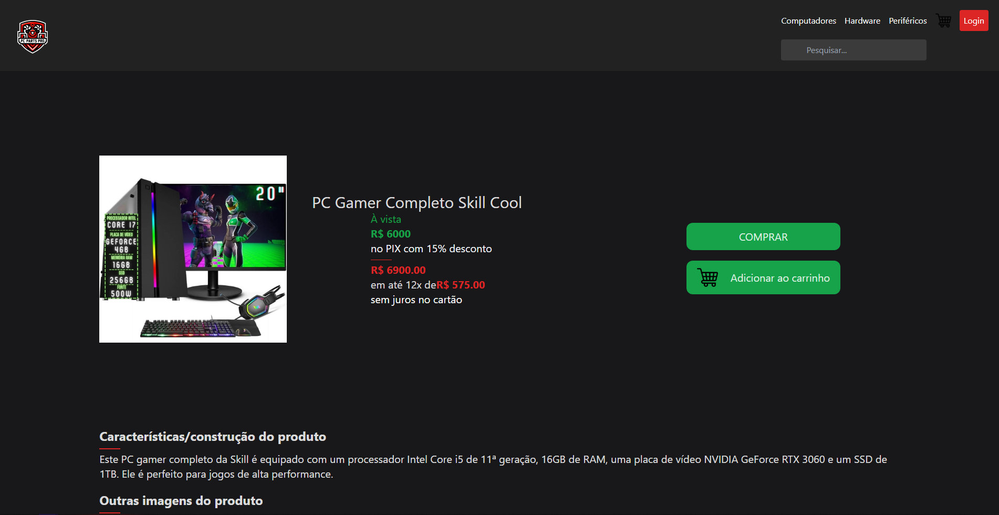

# E-commerce PC PARTS PRO

### Links
  - Figma: https://www.figma.com/file/I4EjxSGz9QUtFC1DA9rfZf/Trabalho-de-com%C3%A9rcio-digital-(Community)?type=design&node-id=0-1&mode=design

  - preview da página: https://faculdade-theta.vercel.app/

  - repositório: https://github.com/JVKSoul/Faculdade/tree/main

  
Algumas imagens o projeto 

  
  
  
  
  
  

## Descrição do Projeto

Este é um projeto de e-commerce focado em itens de computadores. Foi desenvolvido como trabalho para a disciplina de Comércio Eletrônico do Instituto Federal do Paraná (IFPR), campus Palmas, como parte das matérias modulares. O projeto foi realizado pelos alunos EduardoMG12 e JVKSoul que se encontram no segundo 2º semestre.

O site apresenta uma variedade de produtos de informática que estão mockados para fins de demonstração. Cada produto possui uma página própria com fotos, descrição e a opção de adicionar ao carrinho.

## Tecnologias Utilizadas

O projeto foi desenvolvido utilizando as seguintes tecnologias:

- React com Tailwind CSS: Para a construção dos componentes da interface do usuário.
- TypeScript: Para adicionar tipagem estática ao JavaScript, aumentando a previsibilidade do código.
- Vite: Como ferramenta de build, proporcionando um ambiente de desenvolvimento mais rápido e eficiente.
- React Router DOM: Para o gerenciamento das rotas da aplicação.

## Como Iniciar o Projeto

Para iniciar o projeto, siga os passos abaixo:

1. Clone o repositório para a sua máquina local.
2. Navegue até a pasta do projeto via terminal.
3. Instale as dependências do projeto com o comando `npm install`.
4. Inicie o servidor de desenvolvimento com o comando `npm run dev`.

Após seguir esses passos, o projeto estará rodando na porta 3000 do seu localhost.

## Funcionalidades do Site

O site possui as seguintes funcionalidades:

- **Página Inicial**: Apresenta os produtos disponíveis para compra.
- **Página de Produto**: Ao clicar em um produto na página inicial, o usuário é redirecionado para a página do produto selecionado. Esta página apresenta fotos do produto, uma descrição e a opção de adicionar ao carrinho.
- **Categorias de Produtos**: No cabeçalho do site, existem links para as categorias de produtos: Computadores, Hardware e Periféricos.
- **Barra de Pesquisa**: Localizada no cabeçalho do site, permite ao usuário buscar por produtos específicos.
- **Botão de Carrinho e Login**: Também localizados no cabeçalho do site, porém, não possuem funcionalidades ativas no momento.

Por favor, note que algumas funcionalidades, como a barra de pesquisa e os botões de carrinho e login, estão presentes apenas para fins de demonstração e não possuem funcionalidades ativas.
